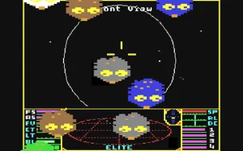
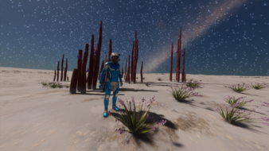
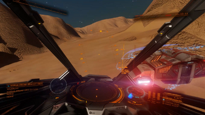

# My Elite Dangerous story (so far)

## Early days
- I first became aware of Elite when, at the age of 10, I went to a friend-of-a-friend's house and saw him playing it on a BBC Micro. I was hooked. I tried to persuade my parents to get me a BBC ("I'll use it for schoolwork") but that didn't fly, so I had to wait until it became available on the Spectrum. I played the Spectrum version, upgraded to a C64 (and discovered trumbles), and then, several years later when I got a PC, I played Elite Plus.
- I graduated on to Frontier and First Encounters when they became available, and remember graduating up through the ship ranks to get a Lion (maybe?) with turrets and the like.
- When I heard that Elite Dangerous was being developed, I was all over it. In Nov 2014 I paid £50 for the beta, and in order to play it I bought a gaming laptop. There wasn't as much variety in the game at back then, but I played for months and got my name on several systems as first discoverer. I eventually worked my way up to owning an Asp Explorer.
- After a break of a few years, I remember loading up the game. I tried to get my ship out of the station and smashed it into the walls. And that put pay to that; it put me off for a long while. Alas, the journal files from those early days never made it.
- I returned to the game properly in Aug 2025. I fell in love with the game again. I did all the things. I started with exobio and quickly built up cash. Then I bought whatever ships I wanted. I followed a video guide to getting the Guardian FSD. I unlocked most of the engineers and upgraded my ships. I joined Powerplay. And I checked off as much of Luriant's to-do list as I could.

## Leaving the bubble
- At the end of 2025 I discovered the FCOC (Fleet Carrier Owners Club) on Discord and took a lift to Colonia to complete the engineering unlocks. That was the first time I left Solo mode.
- From Colonia I made my own little expedition to Sag A\* and learned how to neutron jump on the way. Once at Sag A\*, after doing some more exobio and finding lots of undiscovered Stratum Tectonicas, I took an FC back home, just in time for Xmas.
- By that point I'd learned about the Distant Worlds 3 expedition (DW3) and it was only a couple of weeks till DW3 started.

.png)

## Distant Worlds 3 and Codex bingo
- On DW3 I started out mostly doing exploration. To keep things interesting I decided that I would try and complete the Codex. I had installed SRV Survey on the way to WP2 and it has a Codex bingo feature that tells you how much you've completed. It was on 11%.
- A couple of weeks later I learned that you could right-click the Codex entries in SRV Survey and it would tell you the nearest systems containing species variants you haven't got yet. I thought of this as a double-edged sword. On the one hand it made the challenge a lot easier; on the other it meant that I might actually achieve this. In Elite, having some long-lasting goals is a good thing.
- I succumbed to the temptation of the tool. As of the end of DW3, my Codex completion is just over 50%, so there's still plenty left to do there.

## Racing
- Racing is something I'd not done before DW3. In the first week, when we arrived in Colonia, I discovered the Time Trials in EDCoPilot and ran the SRV races round a couple of starports.
- When we got to Rendezvous Point I joined the SRV rally and the ship race. Thankfully I'd done my homework before the trip and had built a racing Viper. How I wish, in hindsight, that I'd also built the racing Imperial Eagle racing.
- The early races, particularly the SRV ones, were frustrating. I have to laugh when I think back to my first messages on the DW3 racing Discord. I had just done the RR4 Descent, my second SRV race. I didn't know it at the time, but I had the VR setting for "black out to avoid puking" enabled. And so I had zero control in the air because the screen went black. I didn't know any better, so I thought that was just normal for SRVs. *Splat!* Despite that, I still tried again and managed to complete it in 59 mins. And I remember being incredulous at Greaves and Alec Turner for managing to finish the race faster than I could even fly my Cobra to the finish line.
- But the guys on the DW3 racing discord were a very friendly bunch. As I joined more races I posted more in the boards and my confidence at joining the banter grew. As did my racing skills. Well, not so much the SRV. I followed Alec's tutorial videos and did the drills, but knew that I'd only really improve with continued practice. My ship skills turned out to be pretty good. On the canyon races I was getting fairly respectable positions on the leaderboards. Perhaps some of this was due to having an engineered racing Viper for the job.

.png)

## Ship Racing
- When the courses started getting a bit more technical (in an attempt to try and knock Vipers off the top positions), I shipped over my Eagle from the Bubble. I hadn't really flown it before; it was just a little throw-away buy many months ago to see what it was like and bring back some Frontiers nostalgia.
- Fortunately I'd also shipped loads of modules to Chista and was able to cobble together a somewhat decent ship. For the specialist racing kit I just stripped the Viper and would spend the start of each weekend swapping stuff over between the Eagle and Viper depending on the races available at the waypoint.
- I learned that I was pretty good at the Buckyball-style races, aka Crater Makers. These are races where you fly from one starport, beacon, or planet surface to another, which could be in the same system or another. There are usually around five or six destinations. I think all the exobio I'd done really helped with this, and probably it's a little bit of a different skillset.
- Mid to late DW3, SLF racing became a thing. This was the icing on the cake for me. As someone who had spent hours in previous weeks breaking the Eagle/Viper and then having to journey back from the FC to the surface, over and over, the SLF was a welcome addition. Not only that, but the opportunities for engineering are gone, as are the advanced techniques for braking, which results in a more level playing field. And that really tight margin between the top few finishers is what I find so addictive and makes me want to try over and over and over again.

## Building a website
- I wanted to give something back to the DW3 racing community that I'd really enjoyed being part of, so I built a time trials leaderboard site. Another leaderboard site already existed and was great, but I imagined a few extra features that could really help myself and other racers out.
- Things like analysis of your place on the leaderboard for nearby races that would give you feedback on which ones are worth focusing on for the biggest improvements. And which races are nearby that you haven't done yet.
- And, off the back of the racing banter on Discord, I thought a trophy cabinet and the concept of trophy thefts would really stoke up rivalry between top players in a fun way.
- So I built the website, and tinkered with it over the a few few weeks until it contained what I wanted. And then I thought of more things, and it kind of snowballed into a parallel obsession to rival that of the weekend racing.

.png)

## The future
- I write this a couple of weeks before the end of DW3. I'm sad that it's coming to an end. But the pace of it could easily burn me and the others out on the journey. So I expect things to slow down a bit; for people to breathe and rest.
- Racing has become the main activity in Elite for me. I want to do a tour of all the existing races in the bubble and put my name on the leaderboards.
- I expect that the new influx of enthusiastic and inventive race creators from DW3 will start building races around the bubble, and that the Elite Racing Club will be hosting regular Saturday meetups to try out these races. That's my hope.
- Before DW3 I was a solo gamer. I didn't use Discord. Now, thanks to racing, I've found a community. I've found my people. I love playing online with other racers, many of whom I think of as friends.
- I'm just starting to find my voice, turning the mic off mute only occasionally in group calls - but I think that will change pretty quickly.

- Thanks for taking the time to read this. Now get out there and race, race, race!

.png)

***cmdr Vladigor***
