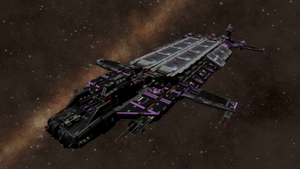
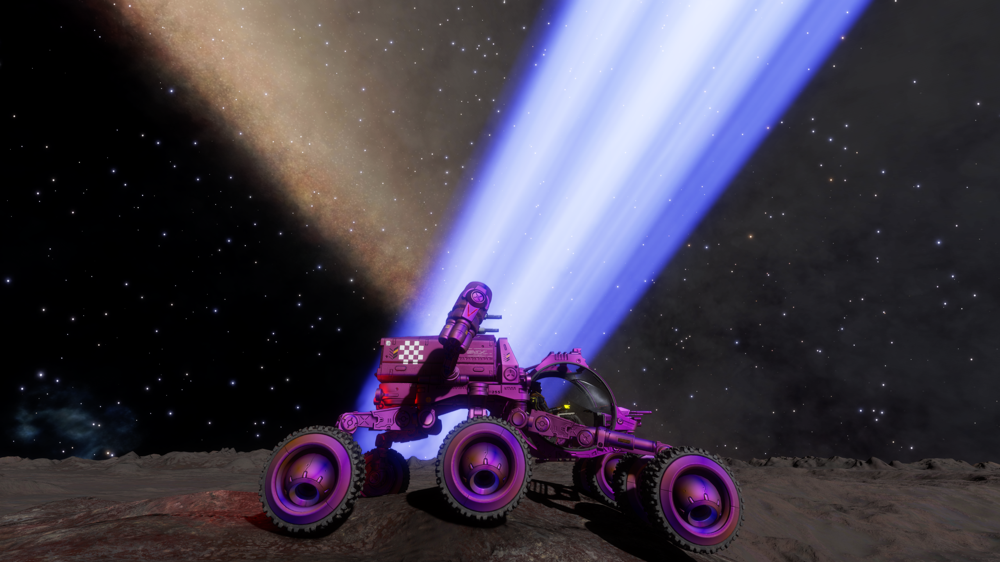
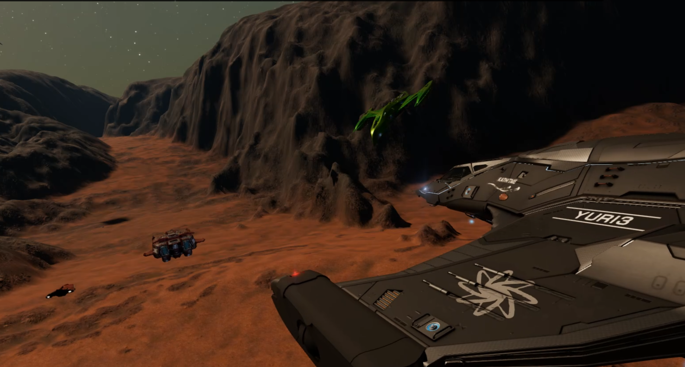
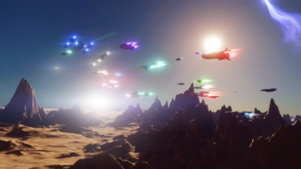
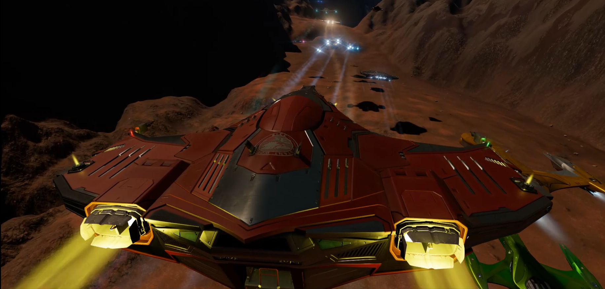
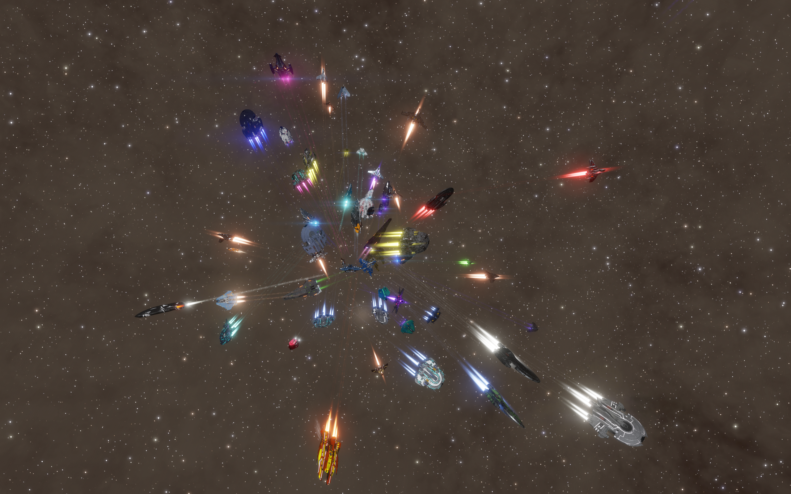

# DW3 Thanks

- The Distant Worlds 3 (DW3) expedition was an amazing experience for me!
- I really want to convey my gratitude to all who those that helped shape it and made it a magnificent journey.

## **Zorya Hopper**

- For *literally* carrying us.
- We appreciate that they've gone above and beyond to make the races more enjoyable for us. 
- For parking in all the right places. 
- For leaving late, for those last minute runs, and yet still arriving early at the next WP! 
- For stocking the FC with the kit we needed - especially when SLF racing became a thing.
- I am honoured to be able to have called the Pillar of Chista home for 5 months.

## **[Alec Turner](/cmdr/ALEC%20TURNER)**

- The pillar and bedrock of the DW3 racing community. 
- For your help and guidance that helped us learn the basics of racing.
- For the races you created: the mountains we climbed and then dived off, and the craters we dove into.
- For all the media promotion you have given to the racing community
- In addition: The Iron and Nickel mining industries thank you too.

## **[Greaves](/cmdr/GREAVES)**

- For the rock solid consistency of creating an SRV rally every single week of the trip to keep us busy and entertained.
- For constantly pushing our limits on what we can make our SRVs do.
- For organizing and hosting the weekend events.
- For ensuring that the whole DW3 community had the opportunity to race.
- And also for consistently topping those leaderboards.

## **[Alexfighter](/cmdr/ALEXFIGHTER)**, **[Foehammer](/cmdr/FOEHAMMER)**, **[Nkirse](/cmdr/NKIRSE)**, **[VR247](/cmdr/VR247)**, **[Drodinn](/cmdr/DRODINN)**, **[Tobias von Brandt](/cmdr/TOBIAS%20VON%20BRANDT)**, **[Rarebear77](/cmdr/RAREBEAR77)**, **[So Much for Subtlety](/cmdr/SO%20MUCH%20FOR%20SUBTLETY)**

- All creative geniuses in my eyes.  You took a blank canvas and created new race types from it.
    - eg. minigolf, motordrome, spaceship fountain,
    - pathfinder, acupuncture, geyser jumping, biathlon.
- These all have created great memories.
- We need creative people like you in the community to keep pushing the boundaries of what time trials can do.
- Some of these race types also opened the door to people to try racing - the on-foot and speedball races being particularly popular with newbies.

## **[Razzafrag](/cmdr/RAZZAFRAG)**

- Without whom time trials would not even be possible.
- For going above and beyond by releasing two killer features for us during DW3. 
- For Waypoint Delta's on the minibar. 
    - What a game changer! No more having to complete a race that in your heart you know you messed up on the 2nd turn.
- For SLF time trials.  Another game changer for me.
    - As a result of this addition I spent so much more time actually racing rather than redeploying my ship to the planet every 5 mins.

## In addition

- To the cmdrs who shared their racing knowledge with the Discord group - you really gave us newbies a big leg up and it is much appreciated.
    - I am attempting to pay this forward by compiling a racing guide from these Discord nuggets - coming soon&trade;.

- To all who joined us in those races and made for exciting competition.
- To those just giving it a go, and to everyone who contributed to the Discord channels and made such a wonderful community.

## o7

### ***Before DW3 I was a player of Elite.  Now I feel that I'm a member of a community.***

Thank you for including me on the journey, **[vladigor](/cmdr/VLADIGOR)**
