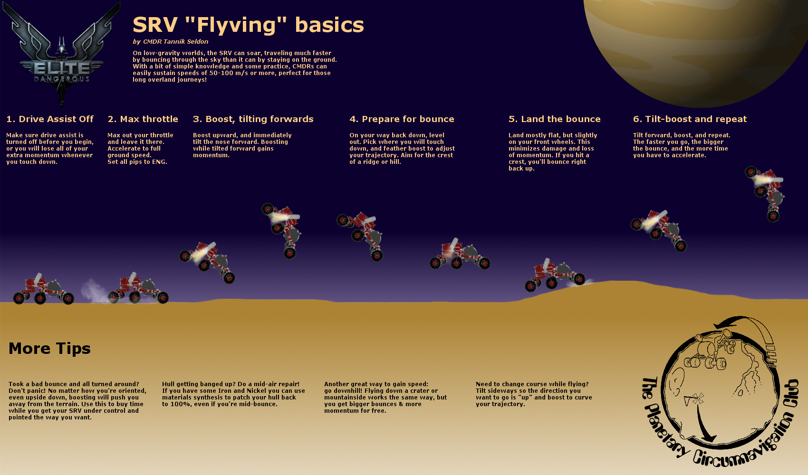

# Racing Guide

Welcome to the exciting (and explosive) world of Elite Dangerous time trial racing! This guide will help you get started with SRV, ship, and fighter racing.

## Prerequisites

**EDCoPilot** ([https://www.razzafrag.com](https://www.razzafrag.com)) is essential for time trial races and for getting on the leaderboards. Without it, your times will not be recorded and it becomes more of a game of Extreme Orienteering than racing.

For instructions on getting started with EDCoPilot time trials, see: [https://razzserver.com/dokuwiki/doku.php?id=time_trials](https://razzserver.com/dokuwiki/doku.php?id=time_trials)

## Is it Dangerous?

Yes! Absolutely. You will become quite familiar with rocks coming towards you very fast, followed by explosions.

### What's the worst that can happen?

Not a lot, really. So long as you obey the first rule of Elite Dangerous: **Never fly a ship you can't afford to rebuy.**

- **Ship races:** If you crash, you will be returned to the last place you docked and you will need to rebuy your ship. If you had any discovery or exobiology data, they will be lost.

- **SRV races:** If you crash, you will be returned to your ship. You will need to buy a new SRV.

- **SLF (Ship-Launched Fighter) races:** If you crash, you will be returned to your ship. You will need to wait for the fighter to be reassembled (80 seconds). After multiple crashes, you'll need to restock at a station.

## Preparation

### Finding Races Near You

Use this leaderboard site ([https://elitettleaderboard.vladigor.net](https://elitettleaderboard.vladigor.net)) to find your nearest races:
1. Go to your commander page
2. Find the **Opportunities** section
3. Enter your current system and click **Find**
4. Click the **Not Done Yet** button to list the nearest races you haven't entered

The Opportunities section also ranks races you've already completed by how catchable the positions above you are, helping you focus on races where you can make the biggest improvements.

### Raw Materials for SRV Racing

For SRV races, stock up on **Iron** and **Nickel** at your nearest Raw Materials Trader. These are used to synthesize SRV repairs during races.

### Engineering Your Ships

You don't *need* a racing ship to participate—but if you want to climb near the top of the ship race leaderboards, you will want one.

Here are some example racing ship builds to get you started:

- [**Viper Mk 3**](https://edsy.org/#/L=IM00000H4C0S80,,mpTCjwG05G_W0,9p3G05I_W0A3wG04J_W0AL7G05I_W0AbDG02K_W0ApGG03G_W0B4SG05L_W0BK4G03G_W0BWQ00,,)
- [**Imperial Eagle**](https://edsy.org/#/L=IP00000I0C0S80,,CjwG05G_W0,9p3G05I_W0A3wG04J_W0AL7G05I_W0AbDG02K_W0AniG03G_W0B2QG05L_W0BIWG03G_W0BWQ00,,)
- [**Cobra Mk 3**](https://edsy.org/#/L=I200000A2C0S00,,,9p3G05I_W0A3wG04J_W0AMgG05I_W0AcnG02K_W0AqqG03G_W0B4SG05L_W0BK4G03G_W0BX_00,,)

Focus on **dirty drives**, **lightweight engineering**, and **enhanced thrusters** for maximum speed and maneuverability.  Also critical is **engine focused** power distributor with **super conduits** for minimum boost recharge time.

## Race Types

## SRV Races

SRV races will take place either on a planet's surface or on the paved roads of a starport. If the former, expect things to get **very** bumpy.

### SRV Flyving Basics

"Flyving" is the art of keeping your SRV airborne as much as possible while maintaining control and speed. Its a complex art, but quite necessary to avoid having to deal with the bumpiness of the terrain and the jankiness of the SRVs steering. Here's the fundamental technique:

**Key Principles:**

1. **Pitch and Roll Control:** When airborne, you need to constantly adjust your SRV's orientation using pitch and roll so that you're facing the direction you're traveling when you land.

2. **Thrust Management:** The SRV has three axes of control—6-wheel drive (actually 8-wheel!), and the rear wheels are also directional. Landing slightly off-center or sideways can cause violent spins.

3. **Drive Assist OFF:** Always turn drive assist off. While binary throttle control (all-or-nothing acceleration) is challenging, it can be overcome with skill and practice.

4.  **Free look:** If you're not using VR you'll probably wait to enable free look so that you can see ahead on steep inclines.

**Recovery Techniques:**

When you find yourself turned around in the air after a bad bounce:
1. Roll the SRV sideways (90 degrees)
2. Use pitch controls (R or F) to rotate until you're facing where you want to go
3. Roll back to upright position
4. Land and continue

**Pro Tips:**

- Watch Alec Turner's tutorial video series for detailed SRV driving techniques: [Drakhyr Rally SRV driving tutorials](https://youtube.com/playlist?list=PLSeEFsl5MwqSOdoqhZD_Bom2kK441imiT)
- For advanced techniques, watch Cmdr Sgurr's [Kumay Snake run](https://youtu.be/gfiP-DheaF8) to see masterful SRV flyving
- Practice makes perfect. The SRV is officially the "Sanity Research Vehicle" for good reason!

## Ship Races

There are several types of ship races, each requiring different techniques and skills.

### Canyon and Starport Races

These races typically feature a maximum altitude limit on waypoints. They require precise flying through tight spaces with sharp turns and elevation changes.

**Ship-Specific Handling:**
  - **Imperial Eagle:** Turns very cleanly with excellent maneuverability. Use cargo scoop mainly on the tightest turns.
  - **Cobra Mk 3:** Great lateral thrusters allow you to "kick" hard on corners. Cargo scoop primarily needed for the sharpest turns (like 180-degree peaks).
  - **Viper Mk 3:** Requires constant cargo scoop management throughout the course to control speed on most turns.  **TODO:** Revise this statement. Mention speed and boost, not cargo scoop.
  - **Imperial Courier:** Much more difficult to fly—it cannot change directions quickly even when boosting with cargo scoop. Loses significant time on sharp turns and 360-degree sections, but has better acceleration and distributor.

**Advanced Techniques:**

#### Flight Assist Off (FA-Off)

FA-Off allows you to drift at maximum speed for extended periods without constantly boosting. The faster runs will have seemingly leisurely periods where pilots are just quietly drifting at speed rather than frantically boosting.

**Benefits:**
- Conserve boost energy for when you really need it
- Maintain speed through corners by drifting
- More control over your trajectory in zero-gravity sections

**FA-Off and Gravity:**
If you disable Flight Assist in a planet's gravity well (like near the surface), you **will fall**. The ship does not hover with FA-Off.

#### Cargo Scoop Braking

Opening your cargo scoop creates significant drag, slowing you down without losing boost energy. This is especially useful for the Viper Mk 3.

- **Scoop-Boost Technique:** Keep your cargo scoop open most of the time, but briefly close it to let off just enough speed to boost forward in the direction you need for tight turns. The key is closing the scoop just long enough to reach the turn exit with some boost multiplier remaining.

- **The Viper Advantage:** The Viper barely loses forward momentum when using the cargo scoop—you only need to release it for a fraction of a second to get back above 800 m/s. Other ships lose speed more quickly.

- **Landing Gear Alternative:** Landing gear can also be used for braking, though cargo scoop is generally preferred.

### Inter-Planetary Races

These are like Buckyball races—you'll need to take off from one planet and fly to another, landing at either a starport or in a crater. These require different skills from canyon racing, focusing on supercruise approach techniques.

**The Corkscrew Supercruise Approach:**

This technique allows you to enter Orbital Cruise and Glide at surprisingly high speeds:

1. **Max throttle until ETA hits 0:04**
2. **Zero the throttle and enter a corkscrew** (massive pitch, steering with roll and yaw)
3. **Keep the ETA around 0:03** by carefully controlling speed and trajectory
4. **Watch the station/planet hologram** and plan your curve around to the front
5. **Trust the planet to slow you down** at the last minute
6. **If speed drops too much, open throttle again**—ideally ETA should never go back above 0:05

For absolute top times, you can push the ETA down to 0:02, but this carries risk of overshooting and aborting the run.

**Dropping from orbital cruise to glide:** What triggers "too fast for orbital cruise" is when the **vertical speed indicator goes into the red**. You can reduce vertical speed by:
- Slowing down
- Reducing your angle of attack

The corkscrew gives you greater control over your angle of attack, letting you "slice" your way into both Orbital Cruise and Glide at very high speeds.

**Advanced Tip:** Use nearby planets to brake or reduce speed—it's hard to optimize but can save precious seconds by allowing you to approach from further away at higher speed.

**Tutorial Video:** Watch Alec Turner's [classic controlled supercruise approach](https://youtu.be/nHY6ctI5Jgk) demonstration.

## SLF (Ship-Launched Fighter) Races

Fighter races are similar to ship races but a little slower and with less risk. If the same race is available in both ship and SLF variants, choose the SLF version first to learn the course safely.

**Advantages of SLF Racing:**

- **More level playing field:** No engineering available for fighters
- **Lower risk:** 80-second rebuild time if you crash (vs. ship rebuy)
- **Lower cost:** Only 1,030cr per fighter to restock
- **Great for learning:** Practice race lines without expensive consequences

### Human Fighters

There are three human ship-launched fighters, each available in 5 different weapon loadouts.  However, for racing we only care about the `Aegis F` and `AX1 F` builds - the other variants are slower.

**Quick Comparison (Racing Loadouts Only):**  [[ref](https://www.reddit.com/r/EliteDangerous/comments/58q7cv/everything_you_need_to_know_about_ship_launched/)]

| Fighter Type | Build | Maneuverability | Durability | Speed | Boost |
|--------------|-------|-----------------|------------|-------|-------|
| GU-97 | Aegis F | Pitch 78°/s, Yaw 36°/s, Roll 144°/s | 15 MJ shields/armor | 312 | 540 |
| F63 Condor | Aegis F | Pitch 54°/s, Yaw 23°/s, Roll 115°/s | 25 MJ shields/armor | 327 | 554 |
| Taipan | Aegis F | Pitch 41°/s, Yaw 18°/s, Roll 88°/s | 30 MJ shields, 45 armor | 273 | 564 |
| Taipan | AX1 F | Pitch 41°/s, Yaw 18°/s, Roll 88°/s | 30 MJ shields, 45 armor | 279 | 577 |

### Guardian Fighters

Guardian fighters must be unlocked via the Guardian tech broker and feature faster boost recharge rates.

| Fighter | Speed | Boost |
|---------|-------|-------|
| XG7 Trident | 332 | 563 |
| XG8 Javelin | 332 | 563 |
| XG9 Lance | 332 | 563 |

- **Common Stats:** 30 MJ shields, 10 hull
- **Maneuverability:** Between Condor and GU-97
- **Faster Boost Recharge:** Guardian fighters recharge boost faster than human fighters, but have a lower boost speed than the Taipan.

**Unlocking Guardian Fighters:** See [Exigeous's video guide](https://www.youtube.com/watch?v=4Mqp56VgFAU) for unlocking Guardian fighters via the tech broker.

### Fighter Hangars

To use ship-launched fighters, you need a fighter hangar module:

| Class | Loadouts | Rebuilds | Mass | Power | Price |
|-------|----------|----------|------|-------|-------|
| 5 | 1 | 6 | 20t | 0.25MW | 505,130cr |
| 6 | 2 | 8 per loadout (16 total) | 40t | 0.35MW | 1,640,350cr |
| 7 | 2 | 15 per loadout (30 total) | 60t | 0.35MW | 2,079,090cr |

**Ships that can equip fighter hangars:** Keelback, Alliance Crusader, Federal Gunship, Krait MkII, Type-9 Heavy, Beluga Liner, Type-10 Defender, Anaconda, Federal Corvette, Imperial Cutter

**Important Notes:**

- If a fighter is destroyed, there's an **80-second** rebuild delay before you can launch that loadout again
- Class 6+ hangars let you launch the second loadout while the first rebuilds
- Restocking costs only 1,030cr per fighter

### Advanced Fighter Techniques

**FA-Off:**
This technique is particularly important for non-permaboost ships like the Taipan fighter. Guardian SLFs are permaboost, so there's less to gain, but it's still useful for picking up extra time.

### Starting SLF races in EDCoPilot
When you start an SLF race in EDCoPilot you must remember to select the fighter type that you are flying, as EDCoPilot is not able to get this information from the game's journal file.

## On Foot Races

There are only a couple of on-foot races available. Not much to say about these beyond: put on your running shoes and go!

These races test your parkour skills and knowledge of station/settlement layouts more than anything else.

## Graphics Settings

[See this page](./graphics-settings) for tips on graphics settings for racing.

## Additional Resources

### Leaderboards and Tools

- **Elite TT Leaderboard:** [https://elitettleaderboard.vladigor.net](https://elitettleaderboard.vladigor.net)
  - Commander stats with percentile rankings
  - Opportunities finder for nearest races
  - Trophy case and rivalry tracking
  - Recent activity page
  - Race statistics

- **Alternative Leaderboard:** [https://leaderboard.shangtai.net](https://leaderboard.shangtai.net)

### Race Visualizer

EDCoPilot can save race definition (.txt) and route trace (.csv) files after each run. You can upload these to [https://raceviz.shangtai.net/](https://raceviz.shangtai.net/) to get a 3D visualization of the course and your route, helping you analyze your racing line.

### Tutorial Videos

- **Alec Turner's SRV Tutorial Series:** [Drakhyr Rally SRV driving tutorials](https://youtube.com/playlist?list=PLSeEFsl5MwqSOdoqhZD_Bom2kK441imiT)
- **Mountain Climbing Tutorial:** [https://youtu.be/fi0ta3K-RLo](https://youtu.be/fi0ta3K-RLo)
- **SRV Flyving Skills:** [https://youtu.be/H9fu8k5v6Dc](https://youtu.be/H9fu8k5v6Dc)
- **Pro SRV Techniques:** Watch Cmdr Sgurr's [Kumay Snake run](https://youtu.be/gfiP-DheaF8)
- **Supercruise Approach:** [Classic controlled approach](https://youtu.be/nHY6ctI5Jgk)
- **Guardian Fighter Unlock:** [Exigeous's guide](https://www.youtube.com/watch?v=4Mqp56VgFAU)

### Racing Community

Join the Elite Dangerous racing community on Discord to:
- Get notified of new races
- Share techniques and tips
- Participate in organized racing events
- Watch live racing streams
- Compare times and strategies

## The End

Now get out there and **race! race! race!**

Remember:
- Start with SLF or SRV races to learn the basics safely
- Practice your flyving/FA-Off techniques
- Don't worry about perfect times at first—focus on clean runs
- Study the leaderboards to see where you can improve
- Most importantly: have fun and embrace the explosions!

o7 Commander, and may your boost always recharge when you need it!
