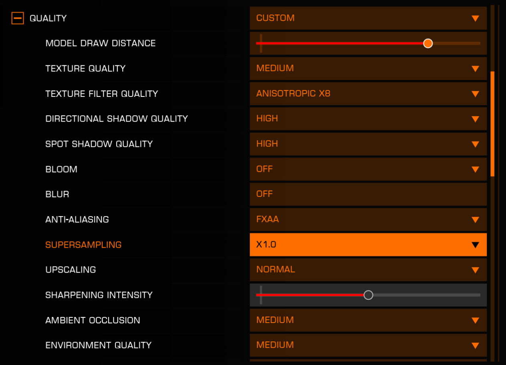
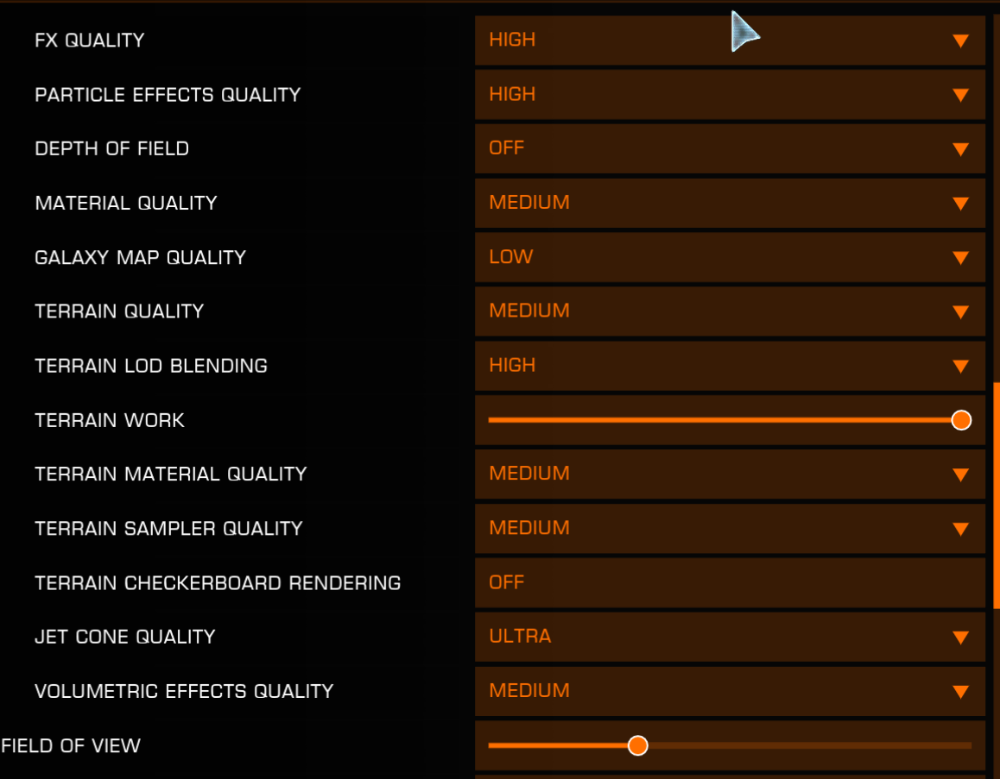

## Graphics Settings for Racing

*Disclaimer: This is a grey area. Take a look at these tips, but do bear in mind that your mileage may vary.*

Terrain morphing (where terrain appears to load in late or "pop in") can be a serious issue in canyon racing, especially at lower frame rates. This can lead to invisible obstacles and frustrating crashes.  If you experience this you might want to try some of the following suggestions.

### Suggested Graphics Settings for Racing

Here are some suggested settings to minimize terrain morphing issues:

**Key Settings:**

- **Terrain Quality:** Medium (not High or Ultra)
- **Terrain Work (GPU Scheduler Multiplier):** Maximum (all the way up)
- **Frame Rate Cap:** **OFF** (this is crucial!)
- **Model Draw Distance:** Medium
- **Texture Quality:** High
- **Shadow Quality:** Medium
- **Other settings:** Can generally stay at High

### Why Frame Rate Matters

In the Display Settings section of the Graphics settings page is an option to cap frame rate (FPS).

Testing suggests that terrain morphing is correlated to frame rate and GPU overhead:

- **Frame cap OFF:** Terrain loads properly, minimal morphing
- **Frame cap at 30 FPS:** Severe terrain morphing, terrain appears late
- **Frame cap at 90 FPS:** Still causes terrain morphing issues
- **200+ FPS:** Terrain loads correctly

The "Terrain Work" slider is actually a "GPU Scheduler Multiplier"—it tells the engine to prioritize terrain updates more often. However, if your GPU is working hard on other graphical features, terrain updates can get backed up in the queue.

**The Solution:**

1. Turn OFF frame rate cap completely
2. Set Terrain Quality to Medium
3. Max out the Terrain Work slider
4. Consider creating a separate graphics preset for racing

### Creating Multiple Graphics Presets

Elite Dangerous doesn't natively support multiple presets, but you can manually manage them:

1. Navigate to: `C:\Users\[YOUR_USERNAME]\AppData\Local\Frontier Developments\Elite Dangerous\Options\Graphics` (or equivalent if you're not on Windows)
2. Copy your `Custom.4.3.fxcfg` file
3. Rename copies to things like `Custom.4.3_RACING.fxcfg` and `Custom.4.3_DEFAULT.fxcfg`
4. Swap files when needed (make sure the active one is named `Custom.4.3.fxcfg`)
5. Keep backup files in a different directory otherwise ED will read them when the game  and create a mismash of settings

**Note:** References to `Custom.4.3.fxcfg` above are correct at the time of writing (ie. Odyssey release). For future releases, look for `Custom.4.4.fxcfg`, `Custom.4.5.fxcfg`, etc. Use the biggest number available.

### VR Considerations

VR users may experience worse terrain morphing because:
- VR typically runs at lower frame rates
- VR has a larger field of view to render
- The engine may force frame rate caps in VR

If you race in VR, the Medium terrain quality and maxed Terrain Work slider are even more critical.

### When in Doubt, Use the Force

If you encounter invisible terrain, remember what old Ben taught us: sometimes you need to learn the course shape and "fly blind" around problematic sections. Many racers memorize terrain features so they can navigate even when textures haven't fully loaded.
